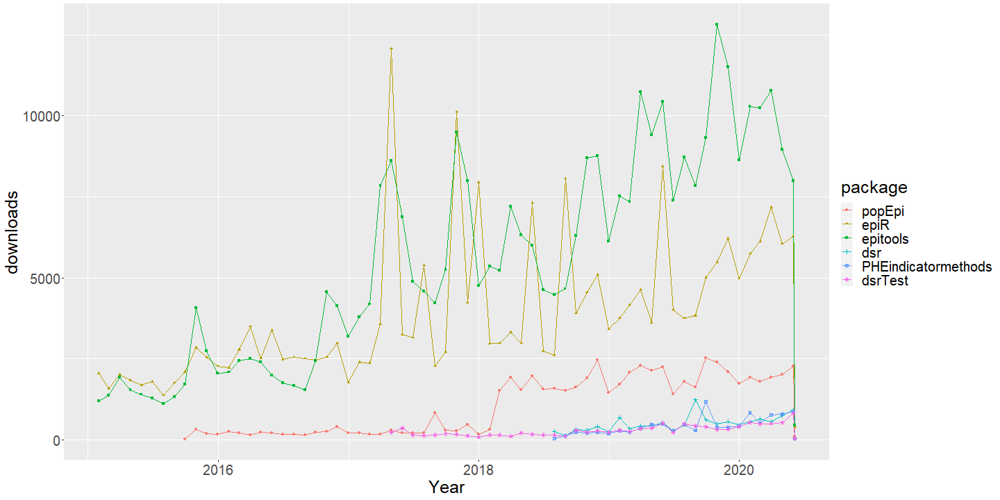

Public health research tools in R
========================================================
author: Mirjam Allik
date: May 28, 2020
autosize: true
transition: none
font-family: 'Helvetica'

Welcome!
========================================================

Who we are

- Mirjam Allik, University of Glasgow
- Jaime Villacampa, Public Health Scotland
- Andrew Baxter, University of Glasgow

Thank you!

MRC/CSO SPHSU at University of Glasgow, PHS and SSM&PH

Plan for the day
========================================================

Morning: R packages for public health

  - Direct standardized rates
  - Health inequality measures (SII/RII)

Afternoon: Presenting results with Shiny

Recap and wrap-up (15.30-16.00)

Stay in touch, let us know what you are working on

Zoom housekeeping
======================================================
<small>
Video lectures:
  - Background and demonstrations
  - Code available <https://github.com/ScotPHO/r-pubhealth-workshop>
  - Participants will be muted

Q&A sessions:
  - Opportunity to clarify some aspects

Participant practice sessions:
  - Take a break
  - Try our the code, focus on an example
  - Chat open, no video stream

</small>

Materials and data
========================================================

A link to the course pack (slides, code and data) has been emailed to all registered participants in advance.

In case you missed it...

<https://github.com/ScotPHO/r-pubhealth-workshop>

Session 1: R packages for public health
========================================================

- How to find and choose between packages?

- Packages for direct standardized rates
  
  + Often these do more than DSRs

- Packages for health inequality measures

No finite complete list!
Pros and cons to all packages!

How to find packages?
========================================================

- Google "how to x, y, z in R"

- search Metacran <https://www.r-pkg.org/>; Crantastic! <https://crantastic.org/>; RDRR <https://rdrr.io/>

- R package `sos` search (searches function help files)

See Wiki Useful resources

R packages for public health
========================================================

There are a lot of methods $\Rightarrow$ there are a lot of packages!

- about 150-200 packages relevant to epidemiology, public/population health
- some very small/specific

On paper many packages seem to do the same thing, but:
- types/format of data
- flexibility
- methods

How to choose?
================================================================

1. Does it do what you need?

  Read documentation, look up vignettes and examples

2. Is it validated?

  Is someone else using it and who built the package

3. Is it convenient?

Package downloads using dlstats
===============================================================

A reality check
==================================================

In most cases building R packages is voluntary work (read: "Not much time!")

- Side product of core work

- Developed with specif data, task or project in mind

Standardization and health inequalities
========================================================

Standardized rates

- Direct (and indirect) standardized rates

Health inequality measures

- Slope and relative indices of inequality

Standardized rates
==================================================

Mortality and morbidity difficult to compare across nations $\Rightarrow$ direct standardization

  - Weighted rates by 5-year age-groups (a reference/standard population is used as weights)
  - Usually weights sum to 100,000 or to 1

$$ dsr = \frac{\sum_{k=1}^{n} P_k n_k}{\sum_{k=1}^{n} P_k} $$

Different methods for SE/CI

Packages for standardized rates
==================================================

- Aggregated data: `epiR`, `epitools`, `PHEindicatormethods`, `dsr`, `dsrTest`

    + Can easily be used on aggregate data with subgroups: `epiR`, `PHEindicatormethods`, `dsr`

- Disaggregated data: `popEpi`, `SocEpi`

Slope and Relative index of inequality
======================================================

<small>

SII is the slope of the linear regression

$$ dsr_{ses} = \alpha + \beta x $$

RII is based on SII 

$$RII = SII/\mu$$  $$RII = (dsr_0 + SII)/dsr_0$$

Very few packages

- Aggregated data: `PHEindicatormethods`

- Disaggregated data: `SocEpi`

Both can easily be used on data with subgroups

</small>

Data for examples
==================================================

- Deaths in England and Wales, 2012 (ONS template)

- Deaths in Scotland by sex, 2012 (NRS)

- Scottish small-area self-rated health data (2011 Census)

$\Rightarrow$ Examples in R

Comparison of packages, Q&A
=====================================================

- Assume very different data structures

- All require some link between age group and weight

- Provide the same DSRs

- Differences in methods for SE, CI and RII

Exercises
====================================================

<https://github.com/ScotPHO/r-pubhealth-workshop/wiki/Session-1-Exercises>

Q&A
=====================================================

